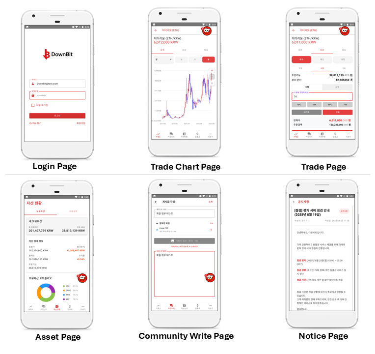

# 🪙 Downbit Exchange (Frontend)


<p align="center">
  <a href="https://kotlinlang.org">
    
  </a>
  <a href="https://developer.android.com">
    
  </a>
  <a href="https://developer.android.com/jetpack/compose">
    
  </a>
  <a href="https://square.github.io/retrofit/">
    
  </a>
  <a href="https://square.github.io/okhttp/">
    
  </a>
  <a href="https://developer.android.com/training/data-storage/room">
    
  </a>
  <a href="https://developer.android.com/ndk">
    
  </a>
</p>

> **Downbit**은 실제 거래소와 유사한 사용자 경험을 제공하는 **가상 코인 거래소 플랫폼**입니다.  
> 회원 관리부터 보안 솔루션 내장, 코인 거래, 자산 관리, 커뮤니티 기능까지 포함한 종합 거래소 서비스를 제공합니다.  
> 본 레포지토리는 **프론트엔드(Android 앱)** 소스코드이며, 팀원 6명이 협업하여 개발했습니다.

---

## 📌 주요 기능 (Features)

### 🔐 보안
- 무결성 검증
- 프리다(Frida) 탐지
- 루팅 탐지
- 디버깅 탐지

### 👤 회원 관리
- 회원가입 / 로그인 / 자동로그인
- 이메일 기반 로그인
- 이메일 찾기 / 패스워드 찾기

### 💱 코인 거래
- 빗썸 API 기반 실시간 시세 반영 및 도식화(차트)
- 20종 코인 거래 지원
- 매수/매도 지정가 거래
- 소수점 단위 거래 지원

### 📊 자산 관리
- 보유 현금 + 코인 비율 시각화
- 전체 자산 현황 한눈에 확인
- 거래 내역 확인

### 🏦 계좌 관리
- 계좌 등록 / 삭제

### 💸 입금 출금
- 입금 / 출금

### 💬 커뮤니티
- 게시글 작성 / 수정 / 삭제
- 댓글 작성 / 수정 / 삭제
- 사용자 간 소통 공간 제공
- 파일 업로드 / 다운로드

### 🙍‍♂️ 마이페이지
- 닉네임 변경
- 프로필 사진 업로드
- 로그아웃 / 회원탈퇴
- 공지사항 확인 (파일 다운로드)
- 1:1 문의하기 (파일 업로드)

---

## 🖼 UI 미리보기



---

## 🛠 기술 스택 (Tech Stack · Android)

- **Platform**: Android (Kotlin), Android Studio
- **OS Targets**
  - `compileSdk`: **36**  
  - `minSdk`: **24**  
- **Networking**: Retrofit2 + OkHttp3  
- **Persistence**: Room(캐시), SharedPreferences(토큰 관리)  
- **NDK**: 보안 모듈 직접 구현 (무결성·프리다·루팅·디버깅 탐지)  

---

## 🔐 보안 솔루션 (Security Solution)

본 프로젝트에서는 자체 보안 모듈(NDK 기반)을 구현하여 앱 실행 환경을 보호합니다.  
주요 탐지 기능은 다음과 같습니다:

1. **무결성 검증** – 앱 바이너리/패키지 위변조 및 서명 검증  
2. **프리다(Frida) 탐지** – 후킹 라이브러리 및 의심 포트 탐지  
3. **루팅 탐지** – `su` 바이너리 및 루팅 흔적 확인  
4. **디버깅 탐지** – 디버거 연결 및 런타임 분석 방어  

---

## 🔗 API & 네트워크 (Bithumb + Retrofit)

- **외부 연동**: 빗썸 Public API 기반 시세 수집  
- **거래 기능**: 20종 코인 매수/매도 **지정가 거래** + **소수점 거래** 지원  
- **Retrofit 구성**: 공통 헤더, 타임아웃, 에러 매핑 인터셉터 적용  
- **토큰 관리**: SharedPreferences를 이용한 액세스/리프레시 토큰 저장 및 자동 로그인 플로우  

---

## 🚀 설치 및 실행 (Getting Started)

```bash
# 1. 레포지토리 클론
git clone https://github.com/Lee99sec/coin-trader/
cd coin-trader

# 2. Android Studio에서 열기
# SDK 36 설치 필요

# 3. 빌드 및 실행
Run → App 실행 (에뮬레이터 또는 실제 기기)
